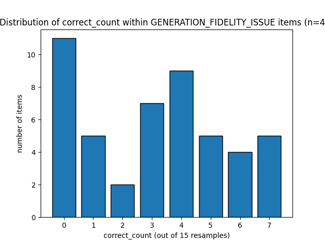

# LRCal-Agent

LRCal-Agent studies whether a low-resource-language LLM system can recognize when it should answer, translate, retrieve evidence, abstain, or escalate instead of answering confidently and incorrectly.

The current project has advanced from setup through a completed Phase 1 no-passage pilot, a Phase 2 passage-retrieval experiment, and a Phase 3 fidelity-control experiment on parallel English/Nepali Belebele multiple-choice questions. Two key findings so far: retrieval behaves very differently by language (adding the correct passage resolves most English failures but only a small minority of Nepali failures), and among the Nepali items retrieval still can't fix, most turn out to be generation-fidelity failures rather than comprehension gaps — the model often can't reliably state the correct answer even when it is handed to it directly.

## Research Question

Can an LLM agent learn a calibrated action policy for low-resource-language QA?

The target action space is:

- `ANSWER`: answer directly when the model is reliable
- `TRANSLATE`: translate or route through a higher-resource language when the model knows the answer in English but not in Nepali
- `RETRIEVE`: fetch missing evidence when the question is answerable only with context
- `ABSTAIN`: decline when the answer remains unsupported or unreliable
- `CLARIFY` / `ESCALATE`: defer when the system cannot safely classify the failure mode

The project is not just measuring accuracy. It is building evidence for a trained policy layer that distinguishes different kinds of failure.

## Core Idea

LRCal-Agent separates the system into two layers:

| Layer | Role | Status |
|---|---|---|
| Layer 1: Calibration signal | Resample the base model many times and measure accuracy, answer agreement, entropy, and failure patterns | Implemented for MCQ pilots |
| Layer 2: Action policy | Learn which action should be taken from calibration and trajectory features | Research target; current phases are generating labels/evidence |

The important methodological shift from the recent work is that failure is not binary. A wrong answer can come from:

- missing evidence
- language-specific access/comprehension failure
- corrupted or mistranslated data
- a true unanswerable/unsupported case
- model instability or confident wrongness

## Current Advancement Summary

### Phase 0: Setup and Model Validation

Completed.

This phase established the local model and scoring pipeline:

- selected Tiny Aya Fire via Ollama as the working local multilingual model
- confirmed English vs Nepali/Bengali performance gaps
- observed confidently wrong answers and script-drift failures
- built MCQ answer extraction for A/B/C/D responses
- fixed early false-negative scoring issues caused by language/script variation
- prepared cleaned datasets under `data/processed/`

### Phase 1: No-Passage English/Nepali Pilot

Completed.

A 250-item paired English/Nepali Belebele sample was created. The passage was stripped, and each item was asked in both languages with 15 stochastic resamples per language.

Total trials:

- 250 questions
- 2 languages: Nepali and English
- 15 resamples per question/language
- 7,500 no-passage trials

Aggregate no-passage accuracy:

| Language | Correct / Total | Accuracy |
|---|---:|---:|
| Nepali | 940 / 3,750 | 25.07% |
| English | 1,678 / 3,750 | 44.75% |

Threshold buckets from `data/pilot1/questions_bucket.json`:

| Bucket | Rule | Count | Share |
|---|---|---:|---:|
| `DIRECT` | Nepali accuracy >= 0.70 | 21 | 8.4% |
| `TRANSLATE` | Nepali <= 0.30 and English >= 0.60 | 63 | 25.2% |
| `UNRESOLVED` | Nepali <= 0.30 and English <= 0.30 | 91 | 36.4% |
| `BORDERLINE` | Everything else | 75 | 30.0% |

The first interpretation was that `TRANSLATE` represented language-specific gaps, while `UNRESOLVED` represented likely unanswerable or missing-knowledge cases. Manual review complicated that story.

### Manual Review Finding

A stratified 40-item sample was reviewed from the Phase 1 buckets:

- 20 `UNRESOLVED`
- 10 `BORDERLINE`
- 5 `TRANSLATE`
- 5 `DIRECT`

The review found that many failures were not pure knowledge gaps. In the comparison note, 27 of 40 items initially treated as answerable without the source passage were reclassified as passage-dependent after review. That shifted the hypothesis: many failures were likely evidence gaps because the passage had been removed.

The review also identified dataset issues:

- mistranslated distractor options
- gold-label problems where the source text contradicted the labeled answer
- passage/question alignment concerns

These artifacts should be excluded or tracked separately before treating bucket labels as clean policy labels.

### Phase 2: Passage-Retrieval Experiment

Completed.

The 166 questions from the `UNRESOLVED` and `BORDERLINE` buckets were re-run with the correct source passage prepended to the prompt.

Total with-passage trials:

- 166 questions
- 2 languages
- 15 resamples per question/language
- 4,980 trials

Classification rule in `src/passage_phase/compare_passage_effect.py`:

| Condition | Label |
|---|---|
| no-passage accuracy > 0.30 | `WAS_NOT_FAILING` |
| no-passage <= 0.30 and with-passage >= 0.60 | `RETRIEVE` |
| no-passage <= 0.30 and with-passage <= 0.30 | `STILL_FAILS` |
| otherwise | `PARTIAL_IMPROVEMENT` |

Results from `data/passage1/retrieval_comparison.json`:

| Language | RETRIEVE | STILL_FAILS | PARTIAL_IMPROVEMENT | WAS_NOT_FAILING |
|---|---:|---:|---:|---:|
| Nepali | 15 | 78 | 15 | 58 |
| English | 80 | 27 | 7 | 52 |

Among previously failing items only:

| Language | Previously failing | RETRIEVE | STILL_FAILS | PARTIAL_IMPROVEMENT |
|---|---:|---:|---:|---:|
| Nepali | 108 | 15 (13.9%) | 78 (72.2%) | 15 (13.9%) |
| English | 114 | 80 (70.2%) | 27 (23.7%) | 7 (6.1%) |

### Phase 3: Fidelity-Control Experiment

Completed.

Phase 2 left an open question: for the 78 Nepali `STILL_FAILS` items — cases where the model had the correct passage and still failed — is that a genuine comprehension gap, or an inability to reliably generate/select the right answer even when comprehension isn't the issue? Phase 3 isolates the two.

**Design.** Each of the 78 `STILL_FAILS` Nepali items (from `data/passage1/retrieval_comparison.json`, pulled via `src/fieldity_control/failing_items.py`) was manually audited and given an `english_hint` (an English-language paraphrase of the correct answer) and an `audit_label`:

| `audit_label` | Count | Meaning |
|---|---:|---|
| `VALID_EVIDENCE_MODEL_FAILURE` | 63 | Clean item, evidence is valid |
| `AWKWARD_BUT_USABLE_TRANSLATION` | 10 | Translation is rough but usable |
| `AMBIGUOUS_ITEM` | 3 | Excluded — item itself is ambiguous |
| `CORRUPTED_EVIDENCE` | 2 | Excluded — input data is compromised |

`src/fieldity_control/build_fieldity_control.py` then builds a "control prompt" per item: the passage, question, options, and the English hint, asking the model to answer with a single letter. If the model still can't answer correctly when handed the answer, the failure is generation fidelity, not comprehension.

Each control prompt was resampled 15 times against Tiny Aya Fire at temperature 0.7 (`src/fieldity_control/resample_fidelity_control.py`, graded with `src/fieldity_control/answer_fidelty_mcq.py`) — 78 x 15 = 1,170 calls, logged to `data/fidelity_control1/resampled_fidelity_control_output.json`. The answer-extraction regex was tightened partway through the run to require punctuation or an answer-keyword near the letter (not just any bare A-D character); re-validated retroactively against the same raw responses, the corrected/total count held at 472/1,170, confirming the fix only reclassified previously-wrong guesses as unparseable rather than changing genuine correct/incorrect calls.

**Finding 1 — overall accuracy is only 40.3% (472/1,170)** on a task where the model is handed the answer directly. That's far below what a "control" condition should produce, and is the core evidence that generation fidelity, not comprehension, is the dominant failure mode.

**Finding 2 — Tiny Aya Fire has a real position bias toward option A**, confirmed both by raw-response inspection and by letter-conditioned accuracy:

| Correct letter | Correct-answer share | Selected share | Accuracy when this is the correct letter |
|---|---:|---:|---:|
| A | 29.5% | 45.7% | 60.3% |
| B | 19.2% | 13.5% | 29.8% |
| C | 17.9% | 16.8% | 35.2% |
| D | 33.3% | 15.7% | 31.5% |

A is picked far more than its ground-truth share (blind guessing toward A partly masquerades as "correct"), while B, C, and D are under-picked relative to their share and answered correctly far less often when they are the right choice. This means any pass/fail result on an A-correct item is confounded with blind position bias.

**Side investigation — Qwen2.5-1.5B-instruct as a candidate Layer 2 model.** The same 1,170-call battery was run against Qwen. It scored lower overall (345/1,170 = 29.5%) and showed an even more extreme bias, selecting D 77.1% of the time. Its apparent per-bucket "wins" evaporated under a bias-controlled check: splitting the `AWKWARD_BUT_USABLE_TRANSLATION` bucket into D-correct vs. non-D-correct subsets, Qwen scored 71.1% vs. 0.0% respectively — its bucket advantage was fully explained by that bucket's ground-truth letters happening to skew toward D, not genuine capability. No complementary Layer 2 candidate found here; the general takeaway is to never trust a per-bucket model comparison without conditioning on answer position first.

**Classification.** The 5 flagged items (`AMBIGUOUS_ITEM` + `CORRUPTED_EVIDENCE`) were excluded, leaving 73 clean items (`src/fieldity_control/filter_resampled_items.py`, `data/fidelity_control1/filtered_resampled_items.json`). Each item was classified by majority vote (>= 8/15 correct, the only meaningful "more right than wrong" threshold with an odd resample count):

| Classification | Count | Share | Meaning |
|---|---:|---:|---|
| `GENERATION_FIDELITY_ISSUE` | 48 | 65.8% | Failed even with the answer handed to it |
| `COMPREHENSION_GAP` | 13 | 17.8% | Passed, correct letter wasn't A — a real win |
| `PASS_CONFOUNDED_BY_BIAS` | 12 | 16.4% | Passed, but correct letter was A — can't rule out blind bias |

(`data/fidelity_control1/phase3_classification.json`, `data/fidelity_control1/phase3_classification_summary.json`)

**Follow-up refinement.** Breaking the 48 `GENERATION_FIDELITY_ISSUE` items down by raw `correct_count` (0-15, via `src/fieldity_control/viz_resample_classification.py`, plotted in `gen_fidelity_correct_count_hist.png`) shows the failures aren't uniformly "near-miss":

- 18 items (37.5%): near-total failure, 0-2/15 correct even with the answer handed to them
- 16 items (33.3%): weak partial signal, 3-4/15 correct
- 14 items (29.2%): borderline/unstable, 5-7/15 correct

This suggests three different remedies rather than one — near-total failures likely need a translate/retrieve/abstain fallback rather than voting; weak-partial cases need stronger verification against evidence; only the borderline tier is a good candidate for consistency/voting-based repair, and even that needs confirmation that the correct answer is the actual plurality winner across resamples rather than assumed from the count.



### Follow-up: Logprob-Based Bias Verification (`infra_check`)

Completed.

Phase 3 flagged 12 items as `PASS_CONFOUNDED_BY_BIAS` — cases where the model passed the control task (>= 8/15 correct at temperature 0.7) but the correct letter was A, so the pass couldn't be distinguished from Tiny Aya Fire's position bias toward A. The resample-based vote can't resolve this because sampling noise and bias both push toward the same letter.

`src/bias_policy/infra_check` builds a deterministic check instead of a stochastic one:

- `test_ollama_logprobs.py` pulls the 12 `PASS_CONFOUNDED_BY_BIAS` items out of `data/fidelity_control1/phase3_classification.json` / `resampled_fidelity_control_output.json` into `data/infra_check/ollama_logprobs.json`.
- `build_logprobs.py` dedupes to one prompt per item (12 unique) and wraps each in a single-letter-answer template, saved to `data/infra_check/resample_ollama_logprobs.json`.
- `resample_logprobs.py` calls Ollama's `/api/generate` with `logprobs: true`, `top_logprobs: 20`, and `temperature: 0`, extracts the logprobs for A/B/C/D from the first generated token, and converts them to a softmax distribution over just those four options. A sanity invariant is checked on every item: at temperature 0 the model's emitted token is by construction the argmax over the *full* vocabulary, so if it emitted a letter A-D, that letter must also be the argmax within the extracted A/B/C/D subset — this held on all 12/12 items, confirming the logprob extraction is trustworthy. Results are saved to `data/infra_check/ollama_logprob_probe_results.json`.

**Finding.** At temperature 0 (no sampling noise), the model's true top choice (by logprob) matches the correct letter A on only **7 of 12 items (58.3%)**. The other 5 have a different deterministic argmax (D on 2, and B and C on one each), meaning their earlier temperature-0.7 "pass" was resample noise landing on the biased letter, not a genuine model preference for the correct answer. This further shrinks the trustworthy comprehension-gap count from Phase 3: of the 13 `COMPREHENSION_GAP` + 12 `PASS_CONFOUNDED_BY_BIAS` items previously counted as passes, at most 13 + 7 = 20 look genuinely earned once bias is deterministically controlled for, not 25.

## Main Research Finding So Far

The passage experiment shows a major asymmetry:

- English failures are often evidence gaps. When the correct passage is supplied, about 70% of previously failing English cases recover.
- Nepali failures are usually not resolved by supplying the same evidence. Only about 14% of previously failing Nepali cases become clean `RETRIEVE` cases.

This suggests the policy cannot treat retrieval as language-neutral. For Nepali, the model often receives the correct passage but still cannot reliably extract the answer.

Phase 3 sharpens the "model still cannot use it reliably" case further. At minimum 65.8% of Nepali `STILL_FAILS` items are generation-fidelity failures, not comprehension gaps — the model can't reliably produce the correct letter even when the answer is handed to it directly, and Tiny Aya Fire's measurable bias toward option A means even the 16.4% of "passes" tied to a correct answer of A can't be fully trusted as genuine comprehension. This means `RETRIEVE` alone won't fix the majority of `STILL_FAILS` cases: the policy needs a distinct repair/verification mechanism, not a single knowledge-gap label.

That means the action policy may need to distinguish:

- `RETRIEVE`: evidence missing, retrieval likely fixes the problem
- `ABSTAIN` or `ESCALATE`: evidence present, comprehension gap confirmed, model still cannot use it reliably
- `TRANSLATE`: English recovers where Nepali does not
- a repair/verification path for generation-fidelity failures (distinct from `ABSTAIN`): near-total failures likely need a fallback action, weak-partial cases need evidence-grounded verification, and only borderline/unstable cases are candidates for consistency-based repair

## Project Layout

```text
LRCal-Agent/
  README.md
  fire_api_call/
    src.py                         # Ollama model-call helper
  src/
    pilot_phase/
      sample_items.py              # Build 250 paired EN/NE sample
      build_mcq.py                 # Build no-passage MCQ prompt
      extract_answer_mcq.py        # Extract A/B/C/D model answer
      resample_mcq.py              # Run 15 no-passage resamples
      distribution.py              # Accuracy, entropy, agreement, buckets
      review_sample.py             # Stratified manual-review sample
    passage_phase/
      sample_passage_items.py      # Reattach source passages
      filter_unresolved_items.py   # Keep UNRESOLVED/BORDERLINE items
      build_passage_mcq.py         # Build with-passage MCQ prompt
      answer_passage_mcq.py        # Extract with-passage answer
      resample_unresolved_pmcq.py  # Run with-passage resamples
      compare_passage_effect.py    # Compare no-passage vs with-passage
    fieldity_control/
      failing_items.py             # Pull Nepali STILL_FAILS items from Phase 2
      build_fieldity_control.py    # Build control prompts (passage+question+hint)
      answer_fidelty_mcq.py        # Extract A/B/C/D from control-prompt responses
      resample_fidelity_control.py # Run 15 control resamples per item
      filter_resampled_items.py    # Exclude flagged items, classify by majority vote
      viz_resample_classification.py # Histogram of correct_count within failures
    bias_policy/
      infra_check/
        test_ollama_logprobs.py    # Pull PASS_CONFOUNDED_BY_BIAS items from Phase 3
        build_logprobs.py          # Dedupe + build logprob-probe prompts
        resample_logprobs.py       # Query Ollama logprobs at temperature 0, verify bias
    tests/
      distribution_comparision.md  # Current experiment summary and interpretation
  data/
    processed/                     # Cleaned dataset caches
    pilot1/                        # Phase 1 samples, trials, buckets, review sample
    passage1/                      # Phase 2 passage samples and retrieval comparison
    fidelity_control1/             # Phase 3 control prompts, resamples, classification
    infra_check/                   # Logprob-based bias verification for PASS_CONFOUNDED_BY_BIAS
    loader/                        # Dataset loading helpers
    data_cleaner/                  # Dataset-specific cleaners
  results/                         # Early resampling sanity checks
  phases/                          # Phase diagrams
  gen_fidelity_correct_count_hist.png # Phase 3 correct_count histogram
```

## Important Data Artifacts

| File | Meaning |
|---|---|
| `data/pilot1/sample_items.json` | 250 paired English/Nepali Belebele items |
| `data/pilot1/resampling_results.json` | 7,500 no-passage trials |
| `data/pilot1/questions_bucket.json` | Phase 1 threshold bucket assignment |
| `data/pilot1/review_sample.json` | Stratified 40-item manual-review file |
| `data/passage1/sample_passage_items.json` | Same items with source passages attached |
| `data/passage1/unresolved_sample.json` | 166 `UNRESOLVED`/`BORDERLINE` items selected for Phase 2 |
| `data/passage1/resampled_passage_output.json` | 4,980 with-passage trials |
| `data/passage1/retrieval_comparison.json` | No-passage vs with-passage classification |
| `data/fidelity_control1/still_fails_items.json` | 78 Nepali `STILL_FAILS` items pulled from Phase 2 |
| `data/fidelity_control1/fidelity_control_prompts.json` | Audited items + control prompts (passage, question, English hint) |
| `data/fidelity_control1/resampled_fidelity_control_output.json` | 1,170 control-prompt trials (Tiny Aya Fire) |
| `data/fidelity_control1/resampled_fidelity_control_output_qwen_model.json` | Same 1,170-trial battery run against Qwen2.5-1.5B-instruct |
| `data/fidelity_control1/filtered_resampled_items.json` | 73-item clean subset (excludes `AMBIGUOUS_ITEM`/`CORRUPTED_EVIDENCE`) |
| `data/fidelity_control1/phase3_classification.json` | Per-item generation-fidelity vs. comprehension-gap classification |
| `data/fidelity_control1/phase3_classification_summary.json` | Classification counts and percentages |
| `data/infra_check/ollama_logprobs.json` | 12 `PASS_CONFOUNDED_BY_BIAS` items pulled from Phase 3 |
| `data/infra_check/resample_ollama_logprobs.json` | Deduped, single-letter-answer logprob-probe prompts (12 unique) |
| `data/infra_check/ollama_logprob_probe_results.json` | Temperature-0 logprob probe results, deterministic bias check |
| `gen_fidelity_correct_count_hist.png` | Distribution of `correct_count` within generation-fidelity failures |
| `src/tests/distribution_comparision.md` | Human-readable results summary and interpretation |

## Reproducing The Pipeline

Run commands from the repository root.

### Phase 1: No-Passage Pilot

```bash
python -m src.pilot_phase.sample_items
python -m src.pilot_phase.resample_mcq
python -m src.pilot_phase.distribution
python -m src.pilot_phase.review_sample
```

### Phase 2: Passage-Retrieval Experiment

```bash
python -m src.passage_phase.sample_passage_items
python -m src.passage_phase.filter_unresolved_items
python -m src.passage_phase.resample_unresolved_pmcq
python -m src.passage_phase.compare_passage_effect
```

### Phase 3: Fidelity-Control Experiment

```bash
python -m src.fieldity_control.failing_items
# manual audit step: add "english_hint" and "audit_label" to each item in
# data/fidelity_control1/still_fails_items.json before continuing
python -m src.fieldity_control.build_fieldity_control
python -m src.fieldity_control.resample_fidelity_control
python -m src.fieldity_control.filter_resampled_items
python -m src.fieldity_control.viz_resample_classification
```

### Follow-up: Logprob-Based Bias Verification

```bash
python -m src.bias_policy.infra_check.test_ollama_logprobs
python -m src.bias_policy.infra_check.build_logprobs
python -m src.bias_policy.infra_check.resample_logprobs
```

The scripts assume Ollama is available locally and that the configured model can be called through `fire_api_call/src.py`.

Current model constant used by the resampling scripts:

```text
hf.co/CohereLabs/tiny-aya-fire-GGUF:Q4_K_M
```

## Current Interpretation

The project has moved from "can resampling expose low-resource unreliability?" to a sharper finding:

> Evidence retrieval helps English much more than Nepali, even when both languages receive the corresponding source passage.

This matters for LRCal-Agent because a policy trained only on no-passage confidence could mislabel many Nepali cases as retrieval candidates. The Phase 2 results suggest the policy needs features that capture language-conditioned retrieval efficacy, not just whether retrieval is available.

## Next Steps

Near-term:

1. Design and validate a repair/verification mechanism for `GENERATION_FIDELITY_ISSUE` items, tiered by `correct_count` (near-total failure vs. weak-partial vs. borderline/unstable) rather than a single fallback.
2. Verify that the plurality answer across resamples actually matches ground truth for the borderline/unstable tier before treating it as a voting-repairable case.
3. Build a de-biasing step (or bias-aware calibration feature) for Tiny Aya Fire's position bias toward option A, since it confounds the 12 `PASS_CONFOUNDED_BY_BIAS` items and likely biases raw MCQ accuracy elsewhere in the pipeline. The temperature-0 logprob check (`src/bias_policy/infra_check`) narrows this to 5 of the 12 items whose "pass" was resample noise, not a genuine model preference — those 5 should be relabeled as bias-driven passes rather than left as ambiguous.
4. Cleanly separate dataset artifacts from genuine model failures.
5. Build a policy-label table from Phase 1, Phase 2, and Phase 3 outputs (RETRIEVE / COMPREHENSION_GAP / GENERATION_FIDELITY_ISSUE, tiered).
6. Add Bengali and BanglaRQA abstention data back into the action-policy framing.

Later:

1. Integrate translation as an actual tool path.
2. Compare English vs Hindi as recovery targets for Nepali `TRANSLATE` candidates.
3. Evaluate other candidate Layer 2 models with bias-conditioned comparisons (Qwen2.5-1.5B-instruct was ruled out — no genuine complementary capability, just a stronger position bias toward D).
4. Train the Layer 2 policy module using calibration features, language, retrieval status, and action labels.
5. Evaluate whether the trained policy outperforms fixed threshold rules.

## Notes On Reliability

The current findings are strong enough to guide the next research phase, but they are not a full dataset audit.

Known caveats:

- only a subset of items received manual review
- some Nepali passages may be corrupted or misaligned
- some gold labels and distractors have documented defects
- MCQ letter extraction is intentionally simple and should be stress-tested before larger runs
- current thresholds are research heuristics, not final policy boundaries
- Tiny Aya Fire has a confirmed position bias toward option A (45.7% selected vs. 29.5% correct); any pass/fail result on an A-correct item should be treated as potentially confounded, not just Phase 3's `PASS_CONFOUNDED_BY_BIAS` items
- the temperature-0 logprob check only covers the 12 `PASS_CONFOUNDED_BY_BIAS` items so far — the same deterministic-argmax method has not yet been applied to the 13 `COMPREHENSION_GAP` items or the broader dataset to see how far position bias reaches
- Phase 3's trivial-baseline / fact-repetition control (meant to establish a fidelity floor independent of task difficulty) was designed but not fully built out — the answer-handed control task became the main focus instead

These caveats are part of the research contribution: LRCal-Agent is explicitly trying to learn when model behavior is unsupported, unstable, or language-conditionally unreliable.
